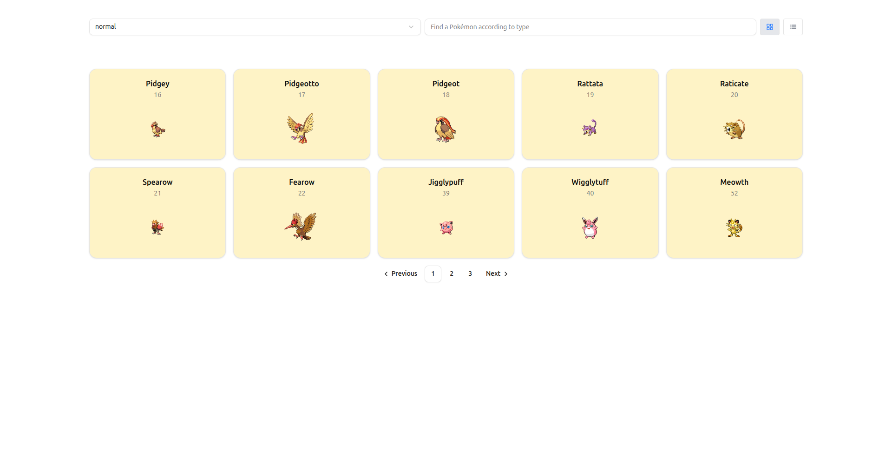
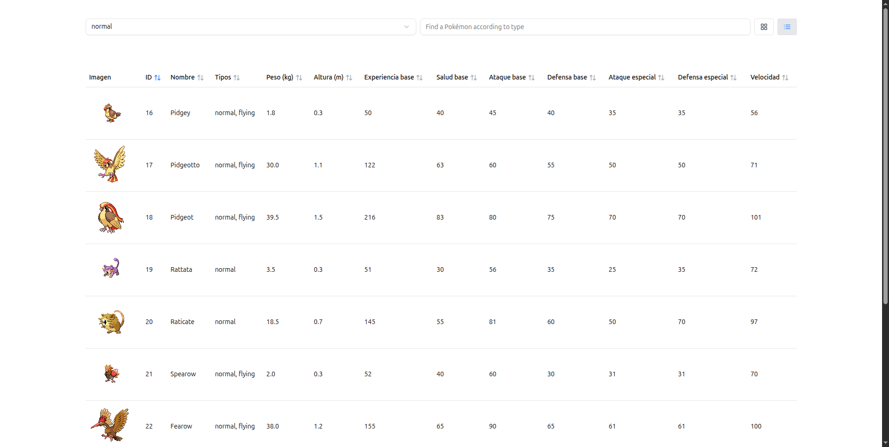

# React + TypeScript + Vite

This template provides a minimal setup to get React working in Vite with HMR and some ESLint rules.

Currently, two official plugins are available:

- [@vitejs/plugin-react](https://github.com/vitejs/vite-plugin-react/blob/main/packages/plugin-react) uses [Babel](https://babeljs.io/) for Fast Refresh
- [@vitejs/plugin-react-swc](https://github.com/vitejs/vite-plugin-react/blob/main/packages/plugin-react-swc) uses [SWC](https://swc.rs/) for Fast Refresh

---

# 🚀 Guía de instalación - Proyecto React

Esta guía te ayudará a clonar, instalar y correr localmente un proyecto creado con React + TypeScript + Vite.

---

## 📦 Requisitos previos

Asegúrate de tener instalado en tu máquina:

- [Node.js](https://nodejs.org/) (versión recomendada: `>= 18`)
- [Git](https://git-scm.com/)
- Un gestor de paquetes:  
  - `npm` (viene con Node.js)  
  - o `yarn` (opcional): `npm install -g yarn`

---

## 🔁 1. Clona el repositorio

```bash
git clone https://github.com/jdvsg12/pokedex-app.git
cd nombre-del-repositorio
```

## 📥 2. Instala las dependencias

### Con npm:
```bash
npm install
```

### Con yarn:
```bash
yarn install
```

## ⚡ 3. Ejecuta el proyecto en modo desarrollo

### Con npm:
```bash
npm run dev
```

### Con yarn:
```bash
yarn dev
```

El proyecto se ejecutará en [http://localhost:5173](http://localhost:5173)

## 📱 Vista previa de la aplicación




*Captura de pantalla de la aplicación en funcionamiento*

---

## 📋 Comandos disponibles

| Comando | Descripción |
|---------|-------------|
| `npm run dev` | Ejecuta la aplicación en modo desarrollo |
| `npm run build` | Construye la aplicación para producción |
| `npm run preview` | Previsualiza la build de producción |
| `npm run lint` | Ejecuta el linter ESLint |

---

## Expanding the ESLint configuration

If you are developing a production application, we recommend updating the configuration to enable type-aware lint rules:

```js
export default tseslint.config([
  globalIgnores(['dist']),
  {
    files: ['**/*.{ts,tsx}'],
    extends: [
      // Other configs...

      // Remove tseslint.configs.recommended and replace with this
      ...tseslint.configs.recommendedTypeChecked,
      // Alternatively, use this for stricter rules
      ...tseslint.configs.strictTypeChecked,
      // Optionally, add this for stylistic rules
      ...tseslint.configs.stylisticTypeChecked,

      // Other configs...
    ],
    languageOptions: {
      parserOptions: {
        project: ['./tsconfig.node.json', './tsconfig.app.json'],
        tsconfigRootDir: import.meta.dirname,
      },
      // other options...
    },
  },
])
```

You can also install [eslint-plugin-react-x](https://github.com/Rel1cx/eslint-react/tree/main/packages/plugins/eslint-plugin-react-x) and [eslint-plugin-react-dom](https://github.com/Rel1cx/eslint-react/tree/main/packages/plugins/eslint-plugin-react-dom) for React-specific lint rules:

```js
// eslint.config.js
import reactX from 'eslint-plugin-react-x'
import reactDom from 'eslint-plugin-react-dom'

export default tseslint.config([
  globalIgnores(['dist']),
  {
    files: ['**/*.{ts,tsx}'],
    extends: [
      // Other configs...
      // Enable lint rules for React
      reactX.configs['recommended-typescript'],
      // Enable lint rules for React DOM
      reactDom.configs.recommended,
    ],
    languageOptions: {
      parserOptions: {
        project: ['./tsconfig.node.json', './tsconfig.app.json'],
        tsconfigRootDir: import.meta.dirname,
      },
      // other options...
    },
  },
])
```

---

## 🛠️ Tecnologías utilizadas

- **React 18** - Biblioteca de JavaScript para construir interfaces de usuario
- **TypeScript** - Superset de JavaScript con tipado estático
- **Vite** - Herramienta de construcción rápida para proyectos web modernos
- **ESLint** - Herramienta de análisis de código estático

## 📞 Soporte

Si tienes algún problema durante la instalación o ejecución del proyecto, por favor:

1. Verifica que tengas las versiones correctas de Node.js y npm
2. Asegúrate de que todas las dependencias se hayan instalado correctamente
3. Consulta la documentación oficial de [Vite](https://vitejs.dev/) y [React](https://react.dev/)

---

¡Listo! 🎉 Ya tienes tu proyecto React funcionando localmente.